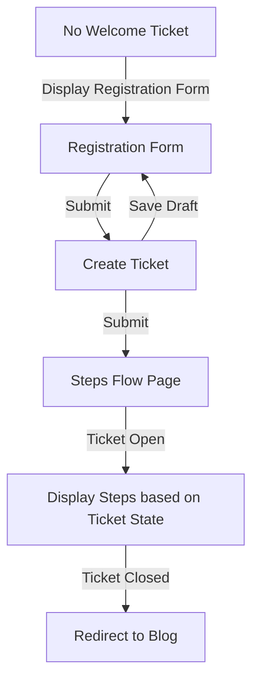

# Zammad Integration Documentation for Next.js Authentication

## Overview

This documentation guides you through the implementation of Zammad as an authentication provider for our Next.js application. The authentication flow accommodates various scenarios, including the absence or presence of a welcome ticket and the dynamic handling of ticket states.

### Zammad API Links:

* [Zammad User API](https://docs.zammad.org/en/latest/api/user.html?highlight=user#me-current-user)
* [Zammad Ticket Tags API](https://docs.zammad.org/en/latest/api/ticket/tags.html)

## Scenario 1: No Welcome Ticket Created

### 1.1 Display Registration Form

In scenarios where no welcome ticket is detected, the application presents the registration form, capturing essential user registration details.

### 1.2 Draft Capability

The registration form supports draft functionality, allowing users to save the ticket before submission. The saved draft retains the form's state, enabling users to resume from where they left off.

#### Example - Zammad Tag API Usage:

```typescript
// Check if the ticket has any existing tags
GET /api/v1/tags?object=Ticket&o_id={ticket id}

// Sample Response:
{
    "tags": [
        "americano",
        "complaint"
    ]
}
```

_Note: Further details on the stored draft content could be provided here._

## Scenario 2: Welcome Ticket Created

### 2. Steps Flow Page

Upon the creation of a welcome ticket, users are directed to a steps flow page. This page dynamically guides users through a two-step process based on the ticket's state.

#### Example - Zammad Tag API Usage:

```typescript
// Check the tags of a ticket to determine its state
GET /api/v1/tags?object=Ticket&o_id={ticket id}

// Sample Response:
{
    "tags": [
        "americano",
        "complaint"
    ]
}
```

_Note: High-level details on how ticket state is determined from tags could be provided here._

* **Open State**: Displays a message guiding users through required steps.
* **Closed State**: Upon ticket closure, the form and steps are hidden. Users are redirected to the blog.

## Implementation

### 3. Zammad Integration

Integrate Zammad as an authentication provider by referring to the [Zammad documentation](https://docs.zammad.org/en/latest/api/user.html?highlight=user#me-current-user).

### 4. Managing Ticket States

Dynamically adjust the steps flow page based on the current state of the welcome ticket using the [Zammad Tag API](https://docs.zammad.org/en/latest/api/ticket/tags.html).

### 5. Redirect to Blog on Ticket Closure

Implement logic to redirect users directly to the blog when the welcome ticket is closed.

## User Authentication

### 6. Retrieve Current User Information

To retrieve information about the currently authenticated user, utilize the [Zammad User API](https://docs.zammad.org/en/latest/api/user.html?highlight=user#me-current-user).

#### Example - Zammad User API Usage:

```typescript
// Retrieve information about the currently authenticated user
GET /api/v1/users/me

// Sample Response:
{
   "id": 3,
   "login": "chris@chrispresso.com",
   "firstname": "Christopher",
   "lastname": "Miller",
   "email": "chris@chrispresso.com",
   // Additional user details...
}
```

_Note: Mock responses for user authentication section requests could be provided here._

### 7. Token Handling

Implement token handling mechanisms to manage user sessions securely. In the context of Next.js and Tailwind CSS, the following TypeScript example illustrates how this can be done:

```typescript
// Import necessary dependencies
import axios, { AxiosInstance } from 'axios';
import storage from "./storage";

// Create an axios instance
export const api: AxiosInstance = axios.create({})

// Configure the API with the base URL and authorization token
export const configureApi = async (): Promise<void> => {
    api.defaults.baseURL = `${await storage.get("url")}/api/v1/`
    api.defaults.headers["Authorization"] = `Token token=${atob(await storage.get("token"))}`
}

// Intercept API responses for handling errors
api.interceptors.response.use(
    (response) => {
        return response
    },
    (error) => {
        console.error(error);
        throw error;
    }
)

// Other API-related functions and classes...

// Example usage in a component
class MyComponent extends React.Component {
    async componentDidMount() {
        // Configure the API before making requests
        await configureApi();

        // Now, you can make requests using the configured API
        api.get('/some-endpoint')
            .then(response => console.log(response))
            .catch(error => console.error(error));
    }

    // Other component logic...
}
```

This TypeScript example assumes the presence of utility functions like `storage.get` for retrieving stored values.

## Reference Implementation

As a valuable reference for the implementation of Zammad authentication in a Next.js application, you can explore the following open-source project:

* [Zammad App Login Component](https://github.com/AddoSolutions/zammad-app/blob/master/src/Login.tsx)
* [Zammad App API Configuration](https://github.com/AddoSolutions/zammad-app/blob/master/src/api.ts)

### Key Points:

1. **Login Component:**
    
    * The [Login Component](https://github.com/AddoSolutions/zammad-app/blob/master/src/Login.tsx) demonstrates the login functionality for Zammad integration. Reviewing this component can provide insights into how authentication is handled in a React-based environment.
2. **API Configuration:**
    
    * The [API Configuration](https://github.com/AddoSolutions/zammad-app/blob/master/src/api.ts) file reveals how the application interacts with the Zammad API. Understanding this configuration is crucial for establishing a connection between your Next.js application and Zammad.

### Implementation Considerations:

* **Ionic Framework:**
    * It's important to note that the referenced project is built using the Ionic framework, primarily designed for mobile app development. While the implementation details may not be directly transferable to a Next.js environment, studying the code can offer valuable insights into the overall authentication flow.

### Example:

1. Visit the provided links to access the respective files in the GitHub repository.
2. Analyze the code to understand the structure and logic behind Zammad authentication in a React/Ionic project.
3. While the specific implementation may differ due to framework disparities, the concepts and approaches can aid in your Next.js implementation.
